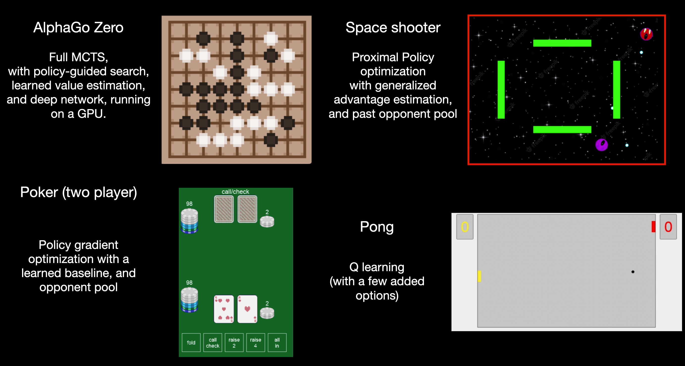

# RL-Demonstrations
 A few reinforcement learning agent demonstrations, including AlphaGoZero, 
 Proximal Policy Optimization, and Q learning.

### The games

## Contents
1. The **MCTS-AlphaGoZero** folder contains an implementation of the AlphaGoZero algorithm 
on a 9x9 Go board, but otherwise using essentially all aspects of the original paper (https://doi.org/10.1038/nature24270).
   - The agent achieves medium human-level play, but has specific vulnerable strategies.
   - It was not trained in parallel (with multiple games at once), nor for multiple days.
2. The Policy-Gradients folder contains two implementations of optimizing a neural network using policy gradients.
   1. **Poker-Agent** is an agent trained to play two-person poker using policy gradients, an opponent pool, and
   masked action space.
   2. **PPO-Space-Shooter-Agent** is an agent trained with proximal policy optimization (PPO) 
   to play a two-person game called "Space Shooter", where two spaceships hide behind
   obstacles and can shoot bullets at each other, trying to explode the other ship.
3. The Q-Learning folder contains two implementations of Q learning with neural networks.
   1. **Pong-Agent** is a simple implementation solving the game Pong (two players bounce a ball back and forth
   and try to not let it go out the end of the board).
   2. **Cartpole-Agent** is a simple network that learns to balance an inverted pendulum.

## How to run each example

Each example is generally structured in two stages:
1. Training: the agent is trained, and a model is checkpointed.
2. Evaluation: the agent can be run, either in self play, or against a human opponent.

To run each agent, you will likely need to follow the following steps:
- Set up a local version and install the relevant packages in python.
  - I've been using Pycharm with a local virtual environment. 
  - Relevant packages include: torch, numpy, tqdm, tensorboard, pygame
  - In pycharm, you can create a virtual environment, then sync the packages in the "requirements.txt" file
  in a few ways. Generally the relevant packages can be found in 
  the requirements.txt file of each folder.
- Set up the files for either training or evaluation of a trained model.
- Run something like "main.py"
- For details, see the README.md files within each subfolder.
  - Usually there is a README_game_mechanics.md which is the readme provided with the original game description.
  - README.md is my own added comments on how to run the programs.

## Citations/Sources of these files
These files were all generated as part of completing a course called "Delta Academy" 
(see https://joindeltaacademy.com and https://github.com/Delta-Academy).

In general, the game mechanics were provided, along with some guidance and skeleton code 
for building the agents, but a majority of the design choices were made independently. 